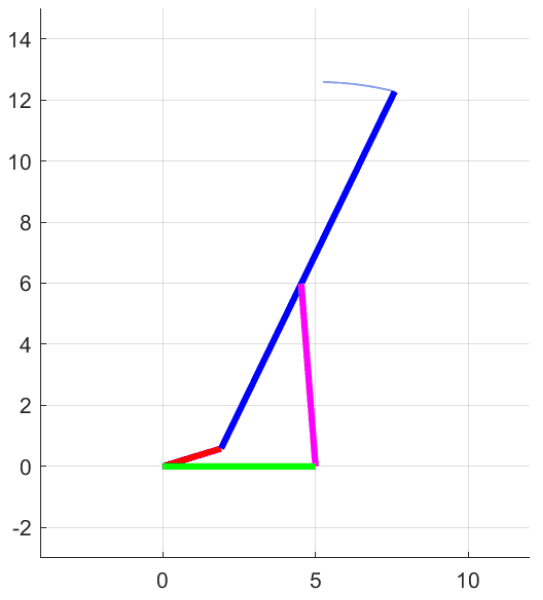
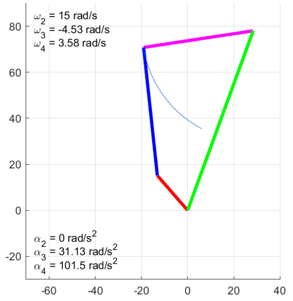

# Simulador de Mecanismos

Simulador que utiliza las ecuaciones de síntesis de posición analítica de mecanismos de 4 barras para generar una animación del mecanismo en funcionamiento. En conjunto con la animación, el programa también despliega las gráficas de la evolución de los diferentes ángulos del mecanismo durante su movimiento.

## Mecanismos de 4 Barras "Estándar"

Para comenzar a utilizar el script, el usuario debe abrir `Sintesis_Posicion_Mecanismos.mlx` en Matlab. Ahí, el usuario baja a la sección de *Mecanismo de 4 barras* y únicamente debe de cambiar cual es el largo de cada eslabón o barra en el mecanismo, dado por los parámetros: `a`, `b`, `c` y `d`. También se puede elegir el `Global_Offset` o el número de grados que se encontrará inclinado el mecanismo completo. Una vez se alteran estos parámetros, se puede bajar a la sección de graficación y elegir si se desea la posición abierta o cerrada del mismo. Con todo esto ya se puede dar click al botón `Run Section`. Esto despliegará la animación deseada y también generará diferentes gráficas detallando la evolución de velocidades y posiciones angulares a lo largo del tiempo. En caso el eslabón manivela (`a`) del mecanismo no pueda completar una revolución completa por restricciones geométricas (mecanismo no grashof) la animación mostrará únicamente la parte del movimiento del mecanismo en la que el mismo no se "atora". Las velocidades de los diferentes eslabones se muestran durante el desarrollo de la animación.

   
    

## Manivela Corredera

Si el usuario lo desea, se pueden simular otras variaciones del mecanismo de 4 barras, como un mecanismo manivela corredera, el cual cuenta con las mismas opciones que el mecanismo de 4 barras "estándar", con la excepción que no se puede establecer el largo de su eslabón `d` ya que este cambia libremente durante el movimiento. Se ofrecen las mismas opciones que antes, generación de gráficas con la evolución de diferentes parámetros, así como una animación con la posibilidad de cambiar entre la versión abierta o cerrada del mecanismo.

## Mecanismo de 5 Barras

WIP. Un mecanismo de 5 barras puede llegar a ser considerado como la unión de dos mecanismos de 4 barras, por lo que se intentó generar un script que animara los mismos. A pesar de esto, el mismo no está terminado y cuenta con errores.
